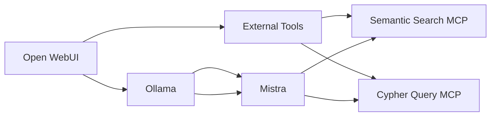

# Neo4j + Ollama + MCP POC

This repository contains a Proof of Concept 
(PoC) for integrating **Neo4j**
and **Ollama** to run Cypher queries with 
natural language. It uses docker and the Model 
Context Protocol. The database is pre-populated, so no additional setup is required.  

## Prerequisites  
Ensure you have **Docker** installed on your system.

## **Quick Start**
1. Clone the repository
2. Run the initial script:
```bash
chmod +x start-containers.sh
./start-containers.sh
```

## Lab Architecture




### This script will:
✅ Pull and run all required Docker containers  
✅ Set up a pre-populated **Neo4j** database  
✅ Copy necessary scripts and dependencies into the containers  
✅ Apply necessary **APOC** configurations  


## Verifying Setup

- **Check Ollama** at: http://localhost:11434 
  -> should say 'Ollama is running'
  - For local LLMs keep http://ollama:11434 as 
    ollama host under 'pipelines'
  - For using our Jetson Orin Nano (or some other 
    machine) -> 
    http://IP_OF_HOST:11434 as ollama host 
    under 'pipelines'

- **Access Neo4j** at: [http://localhost:7474](http://localhost:7474)  
  - Default username: `neo4j`  
  - Default password: `neo4j123`  

- **Access OpenWebUI** at: 
  [http://localhost:8088](http://localhost:8088)  

- **Check running containers (open-webui, pipelines, neo4j):**  
  ```bash
  docker ps
  ```
  
## Connecting the MCP-Server Container to OpenWebUI

After running the script, the **MCP-Server 
container** should be up. Connect it under 
'Admin Panel' -> 'Settings' -> 'Tools'. Add a 
new connection.
- URL: http://neo4j-mcp-server:8000/neo4j-aura
- Bearer: leave it empty
Click on save and then refresh Open WebUI with 
  a fresh cache

### Steps to connect the pipeline:

1. **Access OpenWebUI:**
   Open your browser and go to the following URL: **[http://localhost:8088](http://localhost:8088)**

2. In OpenWebUI, go to the **Admin Panel**

3. Set up the connection to the **MCP Tool Server:**
- Go to the **Settings** tab.
- Under **Tools**, click **Add Connection**.
- In the dialog, enter the following:
  - **URL**: `http://neo4j-mcp-server:8000/neo4j-aura`
  - **Key**: `leave it empty`

This will connect the **OpenWebUI** interface to the **Tool Server**.

4. **Refresh your browser:**
After the connection is established, refresh 
   your Open WebUI browser tab without cache. 
   You should see the toggle for the tool under the '+' 
   symbol in a chat window.

5. **Additional tip**: In the top right corner 
   under '**Controls**': Set 
   the temperature to 0 for higher reliability
